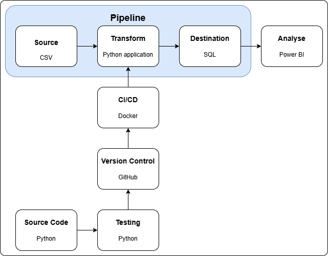
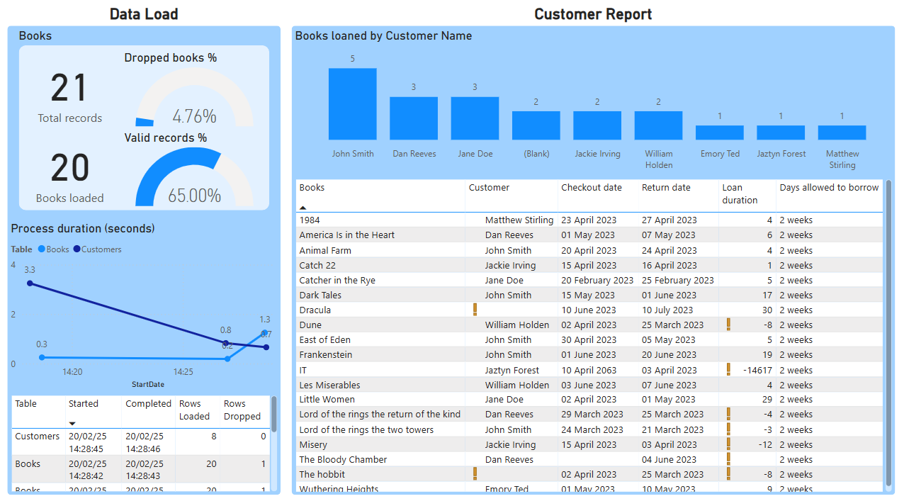

# Project objectives

1. Set up GitHub repo for project
2. Design an architectural diagram for the pipeline
3. Implement the Python application that does the data cleaning
4. Test the Python application
5. If there are no bugs, deploy pipeline (CI/CD)
6. Trigger the pipeline to write to a database
7. Use the written data to create a Power BI dashboard

# Architecture



# Data Cleaning
To process Books data, use the following CLI command:
```
python application/__init__.py --path <path to CSV file> --index <index_col>
```
This will clean the data found in the CSV file then print it to the console.
## Options
The following options are available for the CLI command:
```
--table_name        Specify the SQL table name
--date_columns      Specify any date columns in the data
--date_formats      Specify any date formats for the date columns
--loan_date_col     Name of column that gives the date the book was loaned
--return_date_col   Name of column that gives when the book was returned
```
### SQL Table
To save the cleaned dataframe, as well as a copy of any data that was dropped (excluding null rows), use the following command:
```
python application/__init__.py --path <path to CSV file> --index <index_col> --table_name <table_name>
```
This will save the dataframes to the chosen table name in the Module5 database on the localhost SQL server.

When the script is run, it will overwrite any data that already exists within the table.
### Date columns
Date columns should be specified in for processing:
```
python application/__init__.py --rel_path <path> --date_cols <date1> <date2> ... --date_formats <format1> <format2> ...
```
The formats should be provided using standard Python date format codes: [Python strftime cheatsheet](https://strftime.org/)
### Days on loan
To calculate number of days on loan for a book, first specify all date columns, then specify loan and return date columns:
```
python application/__init__.py --rel_path <path> --date_cols <date1> ... --date_formats <format1> ... --loan_date_col <loan_date> --return_date_col <return_date>
```
This will add the 'DaysOnLoan' column to the processed dataframe.

## Validity checks
By default, some validity checks will be applied to the final dataframe, resulting in an additional column (ValidRow):
### 1. Check for nulls
If any null values exist in a row, then it will be flagged as invalid.

### 2. Date check
If a loan date and return date are specified and exist in the final dataframe, then the code will check that the loan date is before the return date. If not, then the row will be flagged as invalid.

# Data visualisation
To help understand the processed data, as well as monitor recent runs of the process, a Power BI dashbaord has been created.


This will show:
1. How many books have been loaded, and how many of those are valid.
2. How long it has taken to process both the books and customer data
3. How many books are lonaed to customers
4. A full list of the books that are loaned, with details of when they were checked out, when they were retruned, and how long they were borrowed.

# Docker
This application can be set up us a Docker container, making use of the [Dockerfile](./Dockerfile) and [.dockerignore](./.dockerignore) files.

The container is craeted using the following command in the root directory:
```
docker build -t <application_name> .
```

This is then executed as follows, using the same options as described in [Options](#options):
```
docker run <application_name> --path <filepath> --index <index> ...
```

<em>Note that this won't be able to load data to SQL due to an issue with pyodbc - not sure how to fix!</em>